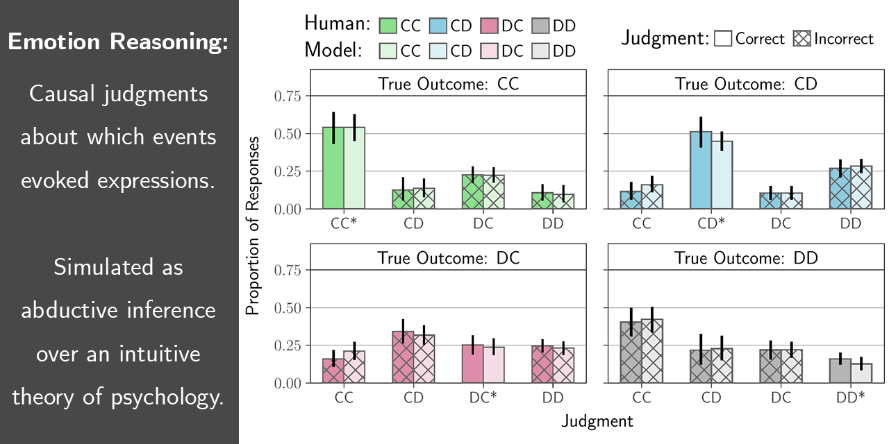
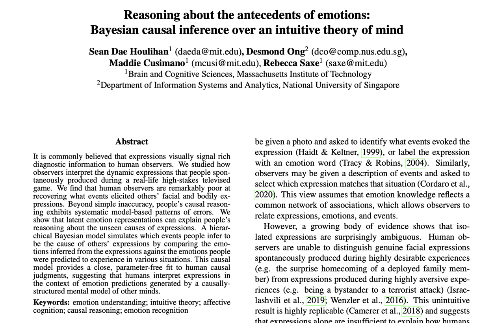

# Reasoning about the antecedents of emotions: Bayesian causal inference over an intuitive theory of mind (CogSci 2022)



**ABSTRACT** It is commonly believed that expressions visually signal rich diagnostic information to human observers. We studied how observers interpret the dynamic expressions that people spontaneously produced during a real-life high-stakes televised game. We find that human observers are remarkably poor at recovering what events elicited others' facial and bodily expressions. Beyond simple inaccuracy, people's causal reasoning exhibits systematic model-based patterns of errors. We show that latent emotion representations can explain people's reasoning about the unseen causes of expressions. A hierarchical Bayesian model simulates which events people infer to be the cause of others' expressions by comparing the emotions inferred from the expressions against the emotions people were predicted to experience in various situations. This causal model provides a close, parameter-free fit to human causal judgments, suggesting that humans interpret expressions in the context of emotion predictions generated by a causally-structured mental model of other minds.

## Project

This repository provides all of the raw behavioral data, analyses, and models related to the 2022 CogSci [talk](https://youtu.be/racs6deM2o4) and [paper](https://escholarship.org/uc/item/7sn3w3n2)

- Houlihan SD, Ong D, Cusimano M, \& Saxe R. (2022). Reasoning about the antecedents of emotions: Bayesian causal inference over an intuitive theory of mind. In *Proceedings of the 44th Annual Conference of the Cognitive Science Society*. 


| <a href="https://youtu.be/racs6deM2o4"></a> | <a href="https://escholarship.org/uc/item/7sn3w3n2"></a> |
| :----------------------------------------------------------: | :----------------------------------------------------------: |
|                      **Talk Recording**                      |                        **Paper PDF**                         |

## Citing the work

If you use this repository, the data it includes, or build on the models/analyses, please cite the paper (NB citation given in Bib***La***Tex):

```BibTeX
@inproceedings{houlihan2022emotionreasoning,
  title = {Reasoning about the antecedents of emotions: {{Bayesian}} causal inference over an intuitive theory of mind},
  shorttitle = {Causal reasoning over emotions},
  booktitle = {Proceedings of the 44th {{Annual Conference}} of the {{Cognitive Science Society}}},
  author = {Houlihan, Sean Dae and Ong, Desmond and Cusimano, Maddie and Saxe, Rebecca},
  date = {2022},
  volume = {44},
  pages = {854--861},
  url = {https://escholarship.org/uc/item/7sn3w3n2},
  eventtitle = {{{CogSci}}}
}
```


## Demos of the stimuli

The introductory video (explaining the rules of the game) and examples of the 5 second videos of players' reactions can be viewed here: [Demos of dynamic expressions spontaneously produced by players on the Golden Balls Gameshow](https://daeh.info/p/emotionreasoning-cogsci2022/).

## Contents of the repository

- `code` - models and analyses
- `datain` - the raw behavioral data collected from human observers
- `experiments` - mTurk experiments used to collect the behavioral data in `datain/`
- `figs` - figures generated by the analyses in `code/`
- `manuscript` - latex code that generates the submitted manuscript
- `website` - the project website, which includes demos of the stimuli used in `experiments/`

## Running the project

You can install the dependencies necessary to regenerate the results and figures using **(1)** [a Docker container](#1-as-a-docker-container-recommended-for-reproducibility) **(2)** [a conda environment](#2-as-a-conda-environment-recommended-for-customization) **(3)** [a pip `requirements` specification](#3-as-a-pip-requirements-specification).

### 1. As a Docker container (recommended for reproducibility)

Requires [Docker](https://www.docker.com/). NB Docker is finicky about the cpu architecture. These instructions are for building the image on an `arm64` processor. For an example of building the image for an `amd64` processor, see `.devcontainer/`.

```bash
### Clone git repo to the current working directory
git clone --branch main https://github.com/daeh/emotionreasoning-cogsci22.git emotionreasoning-cogsci22

### Enter the new directory
cd emotionreasoning-cogsci22

### Build Docker Image
docker buildx build --platform=linux/arm64 --tag emoreasimg .

### Run Container
docker run --rm --platform=linux/arm64 --name=emoreas --volume $(pwd)/:/host/ \
    emoreasimg -u /host/code/wrapper_cogsci.py --projectdir /host/
```

The container tag is arbitrary (you can replace `emoreasimg` with a different label).

### 2. As a conda environment (recommended for customization)

You can use the `conda-lock.yml` file to create an environment. Requires [conda](https://docs.conda.io/en/latest/), [conda-lock](https://github.com/conda-incubator/conda-lock), and a local installation of [TeX Live](https://www.tug.org/texlive/). 

```bash
### Clone git repo to the current working directory
git clone --branch main https://github.com/daeh/emotionreasoning-cogsci22.git emotionreasoning-cogsci22

### Enter the new directory
cd emotionreasoning-cogsci22

### Create the conda environment
conda-lock install --name emoreasenv conda-lock.yml

### Activate the conda environment
conda activate emoreasenv

### Run the python code
python ./code/wrapper_cogsci.py --projectdir $(pwd)
```

The conda environment name is arbitrary (you can replace `emoreasenv` with a different label). 

If the `conda-lock.yml` lock file cannot resolve the dependencies for your system, you can use the `environment.yml` file to create an environment with the latest package versions available. Simply replace the `conda-lock install` line with `conda env create -f environment.yml`. NB the `environment.yml` package specifications are not version-locked, so it is possible that there will be package-version idiosyncrasies.

### 3. As a pip `requirements` specification

If you use a strategy other than [conda](https://docs.conda.io/en/latest/) or [Docker](https://www.docker.com/) to manage python environments, you can install the dependencies using the `requirements.txt` file located in the root directory of the project. You additionally need to have [TeX Live](https://www.tug.org/texlive/) installed locally. 

## Authors

[Sean Dae Houlihan](https://daeh.info), [Desmond Ong](https://web.stanford.edu/~dco/), [Maddie Cusimano](http://www.mit.edu/~mcusi/home.html), [Rebecca Saxe](https://saxelab.mit.edu)

